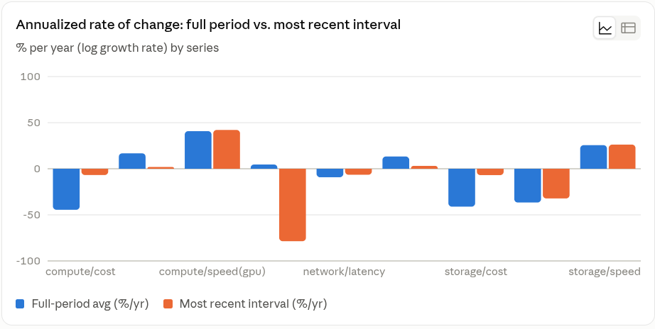

# Day2

Me:

While it is still very abstract to me I have started pondering about a minimal set of values and how to write them down.

Initially I would include both the speed and the cost of an item and note that in the development and progress of many items in IT the flow is almost often step wise and with a higher cost at the beginning of a new capacity as it is not yet common.

my initial set would look like

1. Storage: Cost and Speed although capacity of slower media often greatly outnumbers modern faster storage units.
2. Network bandwidth and cost (Transport would also be a good term here)
3. Compute: Speed and Cost, forgetting temporarily about specialized compute units as the initial trend was to move specialized compute units on the same die.
4. Time as a common for all 6 above

If I remember well, a matrix would be the most appropriate for multidimensional representations.

And starting from known historical Cost and Speed/Bandwidth numbers we could graph each individual item both discrete in the steps they  manifested and a synthetic hypothetical trend line.

The next steps would be the change rate and the acceleration.

S: storage
N: network
C: compute

c: cost
s: speed
t: time

Ss Storage speed, Sc storage cost, and similar: Ns, Nc, Cs, Cs,

You:

The matrix instinct is right, and it's worth being precise about the shape, because your six variables actually have two independent axes buried in the notation (domain: S/N/C, and metric: speed/cost), which a flat matrix can either preserve or accidentally erase depending on how you lay it out.

**The base structure**

At its simplest, each historical time step t gives you a row: `[Ss(t), Sc(t), Ns(t), Nc(t), Cs(t), Cc(t)]`. Stack rows over T time steps and you get a T×6 matrix — this is literally the standard input shape used in the econometric regime-switching models from a moment ago (the FRED-MD dataset those papers use is exactly a matrix of months × economic variables). But because your six columns are really 3 domains crossed with 2 metrics, you may get more mileage treating it as a small tensor — T × 3 × 2 (time, domain, metric) — rather than flattening to T×6. The tensor form lets you slice cleanly: fix the metric axis and you get "cost across all three domains over time" (useful for the crossover comparisons we've been drawing); fix the domain axis and you get "storage's cost and speed together" (useful for a per-domain S-curve). Flattening to T×6 loses that slicing convenience, though it's easier to drop into a spreadsheet, so which one you want depends on whether you'll mostly query by domain, by metric, or both.

**Velocity and acceleration stack as additional layers, not new columns**

Once you have the T×6 (or T×3×2) level matrix, first-differencing it gives you a velocity matrix of the same shape (one row shorter), and differencing that again gives acceleration. So the natural object isn't one matrix but three, stacked: level, velocity, acceleration — each T×6. Your regime buckets (accelerating/steady/decelerating) become a simple sign-and-threshold read on the acceleration layer, cell by cell.

**One correction that matters before you fill in real numbers: work in log space, not raw units.** Cost and speed for these domains change multiplicatively, not additively — storage cost per GB doesn't fall by a fixed dollar amount each year, it falls by a roughly fixed *percentage* each year (this is exactly the Moore's/Wright's-law shape from earlier, and it's why the Santa Fe Institute group's forecast-error number was stated as a logarithmic error, not a raw one). If you difference raw values, your "velocity" will look wildly different in magnitude across domains just because the units differ (dollars per GB versus Mbps), and it'll be non-constant even when the underlying trend is a clean exponential. If instead your matrix stores log(Ss), log(Sc), etc., a first difference becomes an approximate percentage growth rate — directly comparable across all six columns regardless of their native units — and a second difference tells you whether that percentage rate is itself speeding up or slowing down. That's the representation that makes "compare acceleration across storage vs. network vs. compute" a meaningful operation rather than an apples-to-oranges one.

**Two definitional traps worth settling before the numbers go in**

First: does "cost" mean total cost, or cost per unit of capacity/throughput? It needs to be per-unit ($/GB, $/Mbps, $/FLOP) for the matrix to mean anything consistent over time, since total cost conflates "getting cheaper per unit" with "we're buying more units." This connects directly to your own observation about old slow media outnumbering new fast media in raw capacity — that's a real, well-studied pattern (technology substitution / diffusion curves, the classic example being SSD vs. HDD: SSD cost-per-GB fell steeply for two decades following its own Wright's-law curve while installed HDD capacity kept dominating for years on legacy stock alone). If "cost" isn't unit-normalized, that substitution dynamic gets tangled into your cost column instead of being a separate, visible phenomenon.

Second: "speed" may need splitting the same way network already forced you to split bandwidth from latency. Storage has an equivalent split — throughput (MB/s) versus access latency (seek time for spinning disks, effectively near-zero but not zero for SSD) — and these have historically moved at very different rates, the same way network bandwidth and latency did. Whether that's worth a 7th/8th column now or a note to revisit later is your call, but it's the same trap you already caught once.


Me:

exccelent, thanks, lets keep the CSV long form

Can we collext/extrapolate some known numbers on storage,compute,network from puplic data?

You:

I found solid public numbers across all three domains — enough to seed the CSV with real historical anchors rather than guesses. A few of these numbers come from different original sources with slightly different measurement conventions (some inflation-adjusted, some not; some averages, some single benchmark machines), so I've kept a `note` and `source` column on every row rather than presenting it as one clean unified series — that's honest to how public data on this actually looks.

[tech_trends_long.csv](./tech_trends_long.csv)

A few honesty notes on what's in there, since you'll be building on it:

**Storage cost** is the strongest series — a clean, well-sourced trail from $300,000/GB in 1981 down to $0.014/GB in 2022, spanning multiple independent trackers that broadly agree with each other.

**Compute cost per GFLOPS** is similarly strong (the Wikipedia/AI Impacts lineage traces back to a rigorously cited table), but be aware it's a blended metric — cost-per-GFLOPS folds your `Cs` and `Cc` into one ratio rather than keeping them separate. I added a rough independent `compute/speed` series using single-core clock speed instead, precisely so you have something that isn't pre-mixed — but that series badly understates modern "speed" since it ignores multi-core and GPU parallelism entirely. It's a placeholder, not a real answer to "how has compute speed grown," and worth flagging to yourself the next time you touch this file.

**Network** is the most fragmented domain: the speed numbers before 2015 are "best consumer tier available" rather than a consistent benchmark, the cost numbers only really start in 2015 (I couldn't find good nominal $/month figures further back), and the latency rows for all three domains are generic industry figures rather than sourced from a specific historical study — I've labeled those `general industry figures` rather than dressing them up with a fake citation.

That patchiness is itself useful information for your model: it tells you which of your six-plus dimensions have decades of clean public data behind them (storage cost, compute cost) and which are going to need you to either dig further or accept wider error bars (network cost history, all three latency series). Good next move, if you want it, would be picking one thin spot — network cost pre-2015, or a real multi-core/GPU-aware compute-speed series — and running a more targeted search just on that gap.

Me:

yes please try to collect: network cost pre-2015, or a real multi-core/GPU-aware compute-speed series — and running a more targeted search just on that gap.

You:

Both gaps are filled, but they surfaced two things worth knowing before you build on them.

[tech_trends_long2.csv](./tech_trends_long2.csv)

**Network cost pre-2015** now has real anchors: AOL's $9.95/5-hours in 1993 rising to $19.95 flat-rate in 1996, a 2003 FCC/OECD comparison putting average US DSL at $50/month and cable at $45/month, and a couple of scattered 2006/2010/2011 data points. But notice the shape of that story — it's not "cost went steadily down like storage," it's "cost stayed roughly flat around $20-50/month for two decades while speed climbed by several orders of magnitude." That's a genuinely different pattern from storage or compute, and it matters for your model: network's `Nc` dimension may be closer to *constant* than *declining*, with essentially all of the improvement landing in `Ns` instead. Worth checking whether that's a real structural difference (a subscription service priced by market tolerance rather than a hardware unit priced by manufacturing cost) or just an artifact of thin data — I lean toward the former, since ISP monthly pricing is a service price, not a per-unit-of-output price the way $/GB or $/GFLOPS are.

**GPU-based compute speed** is the more interesting fix, and it forced a real schema decision rather than just a data-gap fill. I added it as a *new* metric, `speed_gpu`, rather than overloading your existing `compute/speed` rows — because those are single-core clock speed in GHz, and mixing GHz and GFLOPS under one `metric` label would make any pivot or plot silently nonsensical (you can't average or compare across rows that use two incompatible units for "the same" variable). The two series now sitting side by side make the point about parallelism vividly: clock speed goes from 0.1 GHz (1995) to about 5.5 GHz (2024) — barely more than one order of magnitude in three decades, and flat since the mid-2000s — while flagship consumer GPU FP32 throughput goes from 53 GFLOPS (2004) to 82,580 GFLOPS (2022) — over 1,500x in less time. That gap *is* the specialized-compute-unit story from your ALU doodles, made numeric: almost none of the last twenty years' real compute growth came from the "one dimension" of clock speed you'd get by naively extending the old single-core series.

The schema implication: your six-column model implicitly assumed one clean number per (domain, metric) pair, but compute's "speed" genuinely has at least two distinct measurement conventions that don't reduce to each other — and specialized units (GPU, DSP, whatever comes next) will keep adding more. Rather than a new metric name per unit type (which gets unwieldy fast), you may want an explicit `component` or `architecture` column now — `compute / speed / clock` vs `compute / speed / gpu_fp32` vs eventually `compute / speed / npu_int8` — so the schema itself documents that "compute speed" was never one dimension, it was a family, exactly the thing you flagged a few turns back when you asked whether specialized units deserved their own axes.

Me:

Well naturally as you dive deeper it gets more complicated, especially as we left out any environmental impact and only looked at the raw technology. As we progress into the current time where global warming will begin to have an impact on cooling datacenters and hence its cost I expect many other observers to question the accuracy of the data, as it should be naturally. The idea is to make predictions about things that could or might occur and looking into the future is by definition very fuzzy.

You:

You're right that this isn't a minor caveat to bolt onto the existing model — it's a real candidate for something none of your six columns have shown yet: a genuine reversal, not just deceleration, in a cost curve that's been declining for decades.

The numbers back up the intuition sharply. A recent World Economic Forum / Accenture analysis finds that extreme heat, drought and other climate hazards could raise cumulative annual running costs of data centres in operation today by $3.3 trillion by 2055, with annual costs climbing by $81 billion by 2035 and $168 billion by 2065. And cooling isn't a minor line item you could absorb elsewhere — cooling server racks already accounts for roughly 40% of a typical data center's electricity use, a share confirmed by the U.S. Department of Energy. So this isn't a new seventh dimension sitting quietly alongside the others — it's a force acting directly on the cost side of storage and compute, the two columns in your CSV that have shown the cleanest, longest exponential declines in the historical record. If it bites hard enough, it could be the first real test of whether those curves keep declining or actually bend upward for the first time since the data begins.

That's worth sitting with for a moment: everything in your dataset so far — storage, compute, network — has only ever gotten cheaper and faster, decade over decade, through wars, recessions, and industry collapses. Climate-driven cooling cost is arguably the first candidate force with the physical scale to break that pattern rather than just slow it. Whether it will or won't is genuinely unknown — it depends on how fast cooling technology (liquid cooling, immersion cooling, siting decisions) improves relative to how fast climate hazards worsen, which is exactly the "two competing rates" framing you built a few steps back, just with a new competitor that's never been in the race before.

And this is where your closing point lands the whole conversation somewhere honest: yes, this makes the data messier, and that's not a flaw to fix, it's the nature of what you're doing. Every method we walked through today — Wright's/Moore's law forecasting, regime-switching factor models, IRDS's rolling roadmap, ensemble weather forecasting — exists precisely because long-horizon prediction is fuzzy by construction, not because anyone's been sloppy. The Santa Fe Institute researchers who forecast technology costs put a number on that fuzziness rather than pretending it away: their model's own uncertainty grows at a fairly steady rate the further out you look. Lorenz's finding was even blunter — past roughly two weeks, even a perfect model with perfect data can't forecast weather at all, not because of bad instruments but because the system is structurally chaotic. Your model doesn't need to resolve that tension to be worth building. It needs to carry it honestly — which, given everything you've been doing with notes, sources, and caveats in that CSV, is exactly the habit you've already been practicing.

Me:

So we now have some concrete data over a period of 50 years. What can we say about the rate of change and after that the acceleration/stagnation/slowdown of that change ?
if the is currently already a question we  can ask ?

You:

Now let me actually compute the rates from the corrected data.



```
Annualized rate of change: full period vs. most recent interval
% per year (log growth rate) by series

series	Full-period avg (%/yr)	Most recent interval (%/yr)
compute/cost	        -44.5	-6.8
compute/speed(clock)	16.8	1.9
compute/speed(gpu)	    40.8	42.1
network/cost	         4.7	-78.6
network/latency	        -9.2	-6.5
network/speed	        13.3	3.1
storage/cost	-       41.1	-6.9
storage/latency	-       36.6	-32.2
storage/speed	        25.6	26.2
```

The chart above compares each series' rate averaged over its whole recorded span against its rate over just the most recent interval we have. That comparison is the crudest possible acceleration signal — first derivative (full-period) versus first derivative (recent) — but it's exactly what your accelerating/steady/decelerating framing calls for, and a few real patterns fall out of it cleanly enough to trust, while a couple don't.

**Two series show unambiguous, well-corroborated deceleration.** Storage cost went from declining at roughly 41%/year averaged over 1981-2022 to just 6.9%/year in the most recent interval (2018-2022) — and compute cost per GFLOPS shows the same shape, from 44.5%/year down to 6.8%/year. These aren't isolated to your dataset: the storage slowdown matches what's publicly known as the Kryder's Law slowdown, industry-documented since around 2010 as areal density scaling hit physical limits. That external corroboration is what makes this the trustworthy signal in the chart, not an artifact of your particular sources.

**One series shows dramatic deceleration that you already knew the cause of.** Compute clock speed goes from a 16.8%/year full-period average down to essentially flat — 1.9%/year since 2005. That's Dennard scaling breaking down, exactly as we discussed a few turns back. Good sanity check: the method reproduces a known historical event correctly.

**One series shows no deceleration at all — GPU FLOPS is holding steady, not slowing.** 40.8%/year over the full period versus 42.1%/year in the most recent interval. Unlike clock speed, parallel compute hasn't hit its wall yet in this data. That's the more interesting result, because it directly contradicts what you'd guess if you only tracked "compute speed" as a single clock-speed number — the real compounding is happening entirely in the dimension that number leaves out.

**Some of the network numbers should be discarded, not interpreted.** The most recent network/cost interval shows a −78.6%/year rate, which looks like a dramatic deceleration-into-collapse but is actually a single-year artifact — two different pricing tiers ($98.68 gigabit vs. $44.95 standard) compared across one year, not a real trend. This is the data-sparsity trap from a few turns ago showing up concretely: with only 2-3 points and inconsistent measurement conventions across sources, "acceleration" numbers here are noise, not signal. Worth remembering as you extend the file — a rate computed from two points is only as meaningful as those two points are comparable.

**So, is there already a question worth asking?** Yes, and it's sharper than "will costs keep falling" — it's: **is the storage/compute cost deceleration structural (a real approach to physical limits, like areal density or transistor scaling) or is it a measurement-convention artifact (early data points were "cheapest record-setting configuration available," recent points are "commodity fleet average," which is a different and inherently slower-moving quantity)?** That's exactly the kind of question the Farmer/Nagy technology-forecasting group and the regime-switching econometrics work were built to adjudicate — and it's answerable, in principle, by finding a like-for-like series (e.g., cheapest-available $/GFLOPS continuously through to today, rather than switching definitions partway through) rather than by more raw data collection. That would be the natural next move: not add more series, but make one existing series — storage or compute cost — internally consistent enough to trust its own deceleration signal.
