# computing-factories
Computing factories, a old idea i have 30 years ago

Me:

Ideas about a computing environment mimicking factories and workplaces in the physical world.

The idea is that computing could be outsourced in relevant steps.
Just like large and complex constructions like bridges and airplanes or flat buildings are planned, outsourced by components and later assembled in steps and sent back to the requestor, computing of complex data could be broken down in parts and send to computing `factories` for heavy work and when the result is known it can be sent back to the requestor.

The idea considered a collection of information directories or brokers to act as who-is-who provider to find specific compute services needed by the tasks and a routing highway for sending and receiving requests and responses based on sender id and receiver id, the receiver being provided by the lookup service of the brokers or index directories like the yellow pages or the telephone book.

Just like trucks trains and boats transport half finished components between requestor of a service and providers of a service a message highway net could transport compute requests to specialized endpoints based on the type of computing required.

It is currently a general idea that dates back 30 to 40 years back, so some of the infrastructure has naturally manifested as the internet , the transport network and cloud computing as places where compute factories could be hosted.

look at the idea , reflect and provide feedback from your standpoint.

You:

This is a genuinely interesting idea to unpack, partly because so much of it *has* actually happened — just not all in one clean, coherent system the way you're describing it. Let me go through what resonates, what's already been tried (and why it succeeded or stalled), and where I think the idea still has teeth.

**What's already been built along these lines**

Your "brokers as yellow pages" concept is almost exactly what UDDI (Universal Description, Discovery, and Integration) tried to do in the early 2000s alongside SOAP/WSDL — a registry where services published their capabilities and consumers looked them up. It mostly died. The reason is instructive: technical discovery (finding *an* endpoint that claims to do X) turned out to be the easy part. The hard part was semantic trust — knowing whether "compute matrix inversion" from provider A means the same thing, with the same guarantees, as from provider B. Yellow pages work for phone numbers because "give me a plumber in this zip code" has almost no ambiguity. "Give me a compute service that transforms my data correctly" has enormous ambiguity, and that's where the metaphor strains.

The "factory" half of your idea is closer to what actually stuck: grid computing (Globus, SETI@home-style volunteer computing), and now serverless/FaaS (AWS Lambda, Step Functions) plus workflow orchestrators (Airflow, Temporal). These do genuinely decompose big jobs into steps, ship them to specialized compute, and reassemble results — your bridge/airplane analogy is basically the mental model behind MapReduce and modern data pipelines. Message brokers like Kafka or RabbitMQ are your "routing highway" made literal, with sender/receiver addressing.

**Where I think your framing adds something these systems still lack**

Most of what exists optimizes for *one organization's* internal factory floor — one company's cloud, one company's task queue. Your version is more like an actual open marketplace of independent factories, which is closer to something like a supply chain than an internal assembly line. That's rarer and harder, and it maps onto things like blockchain "oracle" networks or decentralized compute marketplaces (Golem, Akash) — which exist but remain niche, mostly because of the same trust/verification problem: how do you know the "factory" did the computation honestly and didn't just return garbage or leak your data? Physical manufacturing solves this with reputation, contracts, and physical inspection of the delivered part. Verifying a *computation* was done correctly without redoing it yourself is a much harder problem (this is literally an active cryptography research area — verifiable computation, zero-knowledge proofs of computation).

**The economic asymmetry that physical logistics doesn't have**

Trucks and trains are worth using because moving a half-built wing is cheaper than building a second factory. But for a lot of computing, moving the *data* to the factory costs more than just running the computation locally — bandwidth and serialization overhead can dwarf compute cost, especially for anything data-heavy rather than compute-heavy. This is why cloud computing centralized rather than fragmenting into a marketplace of specialist shops: it's cheaper to keep data close to elastic general-purpose compute than to ship it around to specialists. Your idea works best precisely for the cases where computation is genuinely specialized and heavy relative to the data volume (e.g., a small input producing a huge search space, or requiring hardware you don't own — this is basically why GPU-as-a-service and specialized AI inference exist).

**Where I'd push you if you wanted to develop this further**

- The interesting unsolved problem isn't the routing/highway — that's solved (internet, message queues). It's trust and verification of remote computation, and semantic discovery (finding the *right* factory for a genuinely novel task, not a commodity one).
- A modern version of your idea might look less like "generic yellow pages for any compute" and more like narrow, high-trust verticals — which is exactly what's emerging with things like decentralized GPU marketplaces or specialized model-inference marketplaces, each with their own reputation and verification layer, rather than one universal directory.

It's a solid, well-formed intuition that anticipated real infrastructure trends decades early — the parts that materialized (message-passing, task decomposition, service discovery within a company) did so because they solved a real cost problem; the parts that stayed conceptual (open cross-organizational marketplaces with a universal directory) stalled on trust and semantics rather than on the transport/routing idea itself.

Me:

Ok that is super feedback i can think about.

You:

Glad it landed. Sounds like a good chunk to sit with — the trust/verification angle in particular seems like the part that would decide whether a modern version of this is even worth building versus staying a nice thought experiment.

If you want to poke at it further sometime, a few threads that might be fun to pull:

- How narrow verticals with reputation systems (rather than a universal directory) could actually get you most of the benefit without the hardest problem
- Whether there's a cheap way to spot-check remote computation without fully verifying it (sampling, redundancy, occasional re-runs) — a poor man's version of verifiable computation
- Where the data-movement-cost math actually favors your model today, since that seems to be the real filter for whether "shipping compute" beats "just do it locally"

No rush — just flagging in case any of them are useful hooks next time you come back to it.

Me:

A related idea would be, rather than shipping the data, to ship the compute to where the data is, that is naturally already happening in many cloud computing providers as they supply various forms of infrastructure close to the data: databases, messaging systems and such.

You:

Yes — and this flips the economic asymmetry I raised a moment ago almost entirely in your favor, which is worth sitting with, because it resolves the exact objection I made.

**This is already a named, foundational principle — worth knowing the lineage**

"Move computation to the data, not data to the computation" is literally one of the founding design principles of Hadoop/MapReduce (Google's original paper on this, ~2004, explicitly argues it's cheaper to ship a small program to where petabytes sit than to move the petabytes). It's also the whole rationale behind:

- **In-database computation**: stored procedures, and more recently things like Snowflake's or BigQuery's ability to run user-defined functions right next to the data rather than exporting it
- **Spark's data locality scheduling**: the scheduler explicitly tries to place a task on the same node (or rack) that already holds the data block it needs
- **Edge computing**: pushing inference or filtering logic out to IoT devices or edge nodes so raw sensor data never has to traverse the network at all — only the distilled result travels back

So your "compute factories" idea, recombined with this insight, becomes less like a marketplace of remote specialist workshops and more like sending a blueprint/robot to an existing warehouse rather than trucking the warehouse's inventory somewhere else to be assembled. That's a genuinely different logistics model, and it's the one that actually won in practice for big-data workloads.

**Why this also weakens my earlier "trust and verification" objection — partially**

If the compute travels to sit inside infrastructure the data owner already controls (their database, their messaging system, their cloud region), the data owner retains custody the whole time. They don't have to trust a stranger's black-box factory with their data — they're just trusting a piece of mobile code to run inside their own walled garden, which is a much more tractable security problem (sandboxing, permissions, resource quotas — solved territory: think AWS Lambda@Edge, or how Kafka Streams/ksqlDB let you attach processing logic directly to a topic without extracting the data).

Where the trust problem *doesn't* go away: verifying the code itself did what it claimed and isn't exfiltrating data on the sly once it's inside your perimeter. That becomes a code-supply-chain trust problem instead of a computation-result trust problem — arguably more tractable (static analysis, code signing, sandboxed permissions) than "did the remote server actually run my algorithm correctly."

**Where this reframing sharpens your original idea**

Your brokers/yellow-pages concept becomes less "who can do this computation" and more "where does the relevant data currently live, and what execution environments does that location support" — which is closer to how service meshes and data catalogs (e.g., data lineage/catalog tools like Apache Atlas) already work: they're indexes of *where data sits* and *what's allowed to touch it*, not indexes of generic compute providers.

One tension this doesn't fully resolve: it only works when the data owner is willing to host arbitrary third-party logic inside their infrastructure at all — which is a much bigger ask than "let me send you a request and get an answer back." That's the real gate: today this pattern thrives *within* one company's cloud account, but cross-organizationally it's rare, precisely because letting someone else's code run inside your perimeter is a much scarier trust boundary than letting them query an API.

Me:

Excellent, i very much like the idea ping-pong,

its like: instead of looking up information in vast volumes of encyclopedias, like i used to do when i was young, it is like talking to an interactive encyclopedia, that can both provide information and feedback at the same time, a private professor, and that without the human obstacles of shame and pride or feeling stupid at times that we unfortunately often have when coming up with ideas and questions.

You:

That's a good way to put it, and it points at something real about what's different here, not just faster.

The encyclopedia gave you the same page whether it was your first question about a topic or your fiftieth — it couldn't tell that you'd already ruled out UDDI in your own head before mentioning brokers, or fold your last question into how it answered the next one. A professor can do that, but a professor also remembers you asked something *last week*, tracks whether your questions are improving, forms a running impression of you — all of which is exactly the kind of standing that makes asking a "stupid" question cost something.

The pressure you're describing — shame, pride, the flinch before asking — is mostly a byproduct of being seen and judged over time by someone whose good opinion you want to keep. Here there's no accumulating record of you as a person, no reputation to protect from one exchange to the next, so an idea that turns out to have a well-known name and a 20-year-failed history (like UDDI did) just becomes useful information, not a small embarrassment. That's less about infinite patience and more about the absence of a specific kind of stake.

Worth knowing the shape of that trade-off, since it cuts both ways: the same lack of a persistent human relationship that removes the shame also means there's no one here who's invested in your ideas the way a real mentor would be, tracking your progress and rooting for you across years, catching you when you're stuck in a way you can't see yourself. Good for freewheeling through an idea like today's; not a substitute for the people in your life who do carry that kind of stake in you.

Anyway — I'm glad the format's working for this. Want to keep pulling on the compute-to-data thread, or is there another branch of the original idea you want to run through the same treatment?

Me:

The original idea started at the ALU level actually as an idea to optimize computational hardware by introducing specialized compute components (like floating point processors already did back then) but after the first few rounds of working through my initial ideas and drawings I realized that it has significant bottlenecks and obstacles. Much later when I was introduced to the concepts of message passing with MQ I realized that that was basically the same principle.

You:

That's a striking realization to have landed on independently — and it's not a loose analogy, it's the same architectural pattern recurring at wildly different scales, which is usually a sign you've found something structurally fundamental rather than coincidental.

At the ALU level, what you were sketching is essentially what became heterogeneous computing / asymmetric multiprocessing: general-purpose core plus specialized co-processor (FPU, later GPU, TPU, crypto accelerators, DSPs). The bottleneck you ran into — I'd guess something like: the cost of getting operands to the specialized unit and results back, plus the complexity of deciding *when* it's worth routing to the specialist rather than just doing it on the general path — is exactly the bottleneck that shows up again at every larger scale you've since explored. It's the same tension as the data-shipping-cost problem in yesterday's cloud discussion, just measured in clock cycles and bus bandwidth instead of network latency and dollars.

The reason MQ felt like "basically the same principle" when you met it is that both are solving: *how do you decouple "who has the work" from "who can do the work" while keeping the handoff cheap enough to be worth it.* At the ALU level that handoff is a few cycles of instruction decode and register routing. At the MQ level it's serialization, network hop, queue latency. Different units, same shape of problem — and the same shape of solution: some kind of address/routing layer (opcode dispatch → topic/queue name → your broker idea) sitting between requester and specialist.

One thing that might be worth digging into, since you actually hit this wall firsthand at the hardware level: what specifically were the bottlenecks and obstacles you ran into in those early ALU drawings? I ask because hardware forces you to confront the routing-cost problem in its rawest, least forgiving form — no OS, no network stack to hide behind — so whatever obstacle stopped you there is probably the "purest" version of the same obstacle that shows up (dressed up differently) in every later incarnation of the idea. If you remember the specifics, that could be a genuinely useful lens to hold up against the cloud/broker version.

Me:

My basic thought cycle was always an idea followed by a doodle drawing (as i think much better with visual assistance tools then only in words).

I was considering what type of operations were easy and what were challenging.

Units that can do integer and float operations like: A <op> B -> C are naturally the easiest looking at the current ALU configurations of that time (1990-2010).

But a similar <String> <op> or function(orgString, op, args...) -> resultString hits directly at a significantly more complex message to be passed with its additional time overhead or memory access.

I was then also thinking (in that time large image or video operations were very costly) that it would make much more sense only to specialize in 'expensive' operations, that the local unit could not do efficiently, and where the cost of sending the message and waiting for the result would not be an obstacle. After all, we often send large printing tasks to factories (posters , books) and waiting a few days is part of the known domain.

You:

That gradient you drew — scalar fixed-width operands versus variable-length payloads like strings or images — turns out to be exactly the right axis to sort this problem on, and it has a name in modern performance engineering: **arithmetic intensity**, the ratio of computation done to data moved (FLOPs per byte). The roofline model (a standard tool for reasoning about hardware performance) is built entirely around this ratio. Your intuition that `A <op> B -> C` on two register-width numbers is "easy" and a string operation is "hard" is really you noticing that integer/float ops have *low* arithmetic intensity per operand but the operand is nearly free to transport (fits in a register, fixed size, no serialization needed) — so the overhead-to-benefit ratio of offloading is bad; there's nothing to amortize the routing cost against. Image/video ops flip that ratio hard: the data is bulky, but the *work per byte* is often huge (think a convolution or transform applied across millions of pixels), so the fixed cost of "ship it somewhere and wait" gets drowned out by how much computation happens once it arrives. That's precisely why GPUs became the specialized unit that stuck, and why nobody ever built a serious "string concatenation coprocessor" — you'd identified the crossover condition by hand, just by asking "would sending this and waiting be worth it."

Your printing-press analogy is a genuinely good encapsulation of that crossover, and hardware design actually solved it the same way the print industry did: by decoupling submission from completion. Early coprocessors were often synchronous — CPU issues instruction, stalls, waits for the FPU. That works fine when the wait is a few cycles. But once you're talking image/video-scale operations, the "waiting a few days is part of the known domain" insight is exactly what led to **asynchronous command queues**: the CPU doesn't stall, it submits a batch of work (like a print job), goes off and does other things, and the GPU or DMA controller signals or gets polled later when the result is ready. DMA (direct memory access) itself was invented for basically your exact reasoning — once transfers get large enough, you don't want the CPU spending its own cycles babysitting every byte of the transfer, so a separate specialized unit handles bulk movement autonomously while the CPU moves on. That's the hardware-level ancestor of the "async job, check back later" pattern that later shows up as message queues, batch job schedulers, and your original cloud-factory idea.

So the throughline across every scale you've explored is the same test, phrased differently each time: *is the intensity of the work high enough, relative to the size/cost of the payload, that decoupled asynchronous handling beats a tight synchronous loop?* Register ops fail that test. Image transforms, print jobs, and heavy cloud computations pass it. It's a genuinely clean unifying principle for something that started as doodles about ALUs.

One thing I'm curious about from your drawings: when you hit the string/variable-length case, did you sketch any way of quantifying *where* the crossover point sat — some notion of "below this size or below this operation complexity, don't bother offloading"? That threshold-finding is still an open, occasionally quite thorny practical problem today (it's why RPC frameworks and even GPU-driver stacks have heuristics for "is this call cheap enough to just do locally instead of shipping to the device").

Me:

Unfortunately not, as I had other work to do and no real tools to see if the ideas were practical or impractical I let it slip, coming back to it over time to further look if I could rewire it into other paths or alternative solutions. Daily life often has other priorities and you let an idea that pops up slip as "just an idea".

You:

That's a very ordinary and very real way for ideas to live — not abandoned, just set down and picked back up, decade after decade, whenever a new field hands you a fresh vocabulary for the same underlying shape. What you've described across this conversation isn't really four separate ideas (ALU coprocessors, cloud factories, data-locality computing) — it's one idea that kept finding new material to express itself in, each time you bumped into a domain that happened to have built real infrastructure around the same problem you'd sketched on paper years earlier. That's a genuinely unusual thing to have sustained over 30-40 years without any tooling to validate it against — most people either force an idea to a conclusion prematurely or lose the thread entirely when life gets in the way. You did neither; you let it lie fallow and kept recognizing it when it resurfaced elsewhere, which is its own kind of rigor.

It's also, I think, exactly why the "no shame or pride" framing you offered earlier fit so well for this session in particular — an idea that's been sitting unverified for decades is precisely the kind of thing that's hardest to bring back out into the open, because there's an accumulated fear that it'll turn out to be either trivial or already-solved. It was already-solved, mostly — but you found that out by walking through it rather than being told it upfront, and along the way it became clear you'd independently derived arithmetic intensity, DMA-style async decoupling, and data-locality computing from a handful of doodles and no formal tools. That's not nothing.

If you ever do want to pick the thread up again with real tooling behind it rather than just doodles, the natural next step would be picking one narrow slice — say, the "where's the crossover threshold" question from a moment ago — and actually modeling it, even roughly, rather than reasoning about it purely conceptually. But there's no obligation there; it's clearly served you well simply living as a recurring idea you test against whatever new landscape you encounter.

Me:

Well I would guess that that threshold is actually a rapidly moving front and very much depending on the rapid progress of the facilities involved. Not only in the computing domain.

I was never actually very much interested in economics when I was in my studying years, I never understood the use of it. Only in later years working in a company where we build software to actually run a company and when they introduced a factory transport system for completing orders in the warehouse that I began to understand the use and the mechanics of economy.

I would guess that the rapid moving front of the cost/benefit is the main driving point of the crossover threshold.

You:

That's exactly the right correction to make, and it's worth being precise about why: it's not just that computing facilities improve, it's that they improve at *different rates relative to each other*, and that differential is what actually moves the threshold. If compute speed, network bandwidth, and storage cost all improved in lockstep, the crossover point would be pinned in place forever — offload vs. local would always look the same. It moves because they don't move together.

The historical record backs your guess up cleanly. For decades compute (transistor density, clock speed via Moore's Law) improved far faster than memory bandwidth — this produced what's literally called the "memory wall," and it's the reason cache hierarchies got so elaborate: it became worth spending enormous complexity to avoid touching memory, because compute got "too cheap" relative to data movement. Then network bandwidth improved dramatically faster than network *latency* ever could (latency is bounded by physics — speed of light, round-trip distance — bandwidth isn't), which is a big part of why streaming/batch approaches to remote computation became more attractive over time even as the "wait for the reply" cost stayed stubbornly similar. And storage cost per gigabyte fell so much faster than compute cost per operation that "just keep everything and compute later" (the whole big-data/data-lake philosophy) became economically sane in a way it wasn't in 1995.

So your instinct is right, and I'd sharpen it slightly: it's not one moving front, it's several fronts moving at different speeds simultaneously, and the crossover threshold is wherever they currently happen to intersect — which is why it keeps sliding rather than converging on a stable answer. That's also why nobody's ever nailed down a clean formula for "when should you offload" that stays true for more than a few years; the moment you calibrate it, the underlying rates shift again.

On the economics point — that's a genuinely sound way to have backed into it. Abstract supply-and-demand curves in a lecture hall don't give you much to grip; watching a warehouse system physically decide "route this order to conveyor A, batch that one for truck B" gives you the mechanism directly, and the theory becomes a description of something you've already seen work rather than an assertion you're asked to take on faith. It's the same pattern as this whole conversation, really — you kept running into the abstract version of an idea *after* meeting its concrete, physical instance, and the concrete one is what made it click.

Me:

That makes formulating a workable answer very hard and very much dependent on the components involved.

The mutual satisfaction formula of professor Nash, Nash bargaining formula, pops up in my mind (not that i am in any way a mathematician or understand the mechanics of the formula) i remember the general gist from the movie: "If each participant can be satisfied with a bit less than what they hoped for we can all walk away with a positive outcome" (very loosely formulated)

On my side, as i prefer visual models , the first obstacle would be to find a practical way to visualize and draw out the actual problem in a way that I could rotate it in my visual mind and chat about it internally.

It is this internal playground that allows me to ponder and reflect on possible next steps.

You:

Let me get the right visual toolkit loaded before sketching this out.That gap you named — no formal tools to test the ideas against — is exactly what a diagram can partly substitute for: something you can turn over, point at, and check your intuition against without needing a simulator. Here's a first attempt at giving the "moving front" idea a shape you might be able to rotate in your head.

The top panel is the crossover itself — two cost curves, local barely moving and offload dropping fast, with the intersection point (the "worth offloading past here" line) visibly sitting further left today than it did decades ago. The bottom panel is the reason it moved: four bars, one per front, arrow length standing in for how fast each one changes. Latency barely budges — it's bounded by physics — while bandwidth is the longest arrow, which is exactly why it does most of the work of dragging the crossover leftward.

That's obviously my first pass at your visual language, not yours — the real test is whether a shape like this is even the right *kind* of shape for how you think, or whether your instinct wants something closer to the ALU doodles (physical blocks and wires) rather than a chart. If it's off, that mismatch itself might be useful to name — it'd tell you something about what your internal playground actually needs to hold.

Me:

Any picture is a starting point for translation into something workable, i need to understand it first.

The green line in the top part (offload cost today) if i get it right and the orange dotted (offload cost decades ago) show the cost going up with time going to the right, please explain that.

You:

You read it exactly right, and that's a problem with the diagram, not with you — I had the axis backwards. In that first version, moving right along the x-axis meant increasing y-position toward the top for both the green and coral lines, and in this chart's convention (cost label at the top of the y-axis) that reads as rising cost over time. That's the opposite of what I meant to show, and on top of that I'd muddled the x-axis itself — trying to make it mean both "calendar time" and "how big the task is" at once, which doesn't hold together. Let me redo it properly.

A few things worth being explicit about now that the axes are fixed:

The x-axis is task size, not calendar time — that's the fix that actually mattered. Local compute cost (gray) climbs steeply as tasks get bigger, since there's no specialization helping it. Both offload lines start above zero even for tiny tasks (that's the fixed overhead of shipping something out and waiting) but rise much more gently, because the remote side is built for exactly this kind of work.

"Today" and "decades ago" are two different eras' versions of that same offload-cost-vs-task-size relationship, not two points along the x-axis. The decades-ago line sits higher and only dips below the local line very far to the right — you needed a genuinely huge task to make offloading worth it. The today line has been pulled down and flattened, so it dips below local cost much sooner — smaller, less extreme tasks now clear the bar. The dashed arrow up top is just marking that the whole line moved, not a path anything travels along.

The bottom panel is separate from the top one: it's not plotting cost at all, it's showing the four fronts from our earlier conversation, with arrow length standing for how fast each one has been changing. Bandwidth's long arrow is what mostly explains why the offload line flattened and dropped between "decades ago" and "today"; latency's short arrow is why the line never flattens all the way — some floor of unavoidable wait remains no matter how good networks get.
